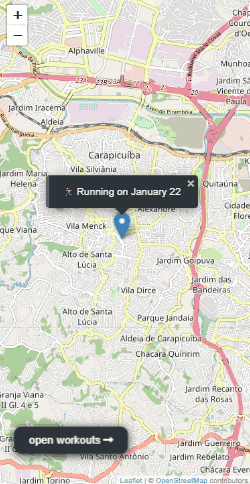

  <b>A great app to map your workouts</b>

# Mapty Workouts

## Table of Contents

- [Overview](#overview)
  - [About the project](#about-the-project)
  - [New features checklist](#new-features-checklist)
  - [Screenshots](#screenshots)
  - [Link](#link)
- [My process](#my-process)
  - [Built With](#built-with)
  - [What I learned](#what-i-learned)
- [Author](#author)

## Overview

### About the project

This workout mapping project was developed during **Jonas Schdmedtmann's Javascript course**, and is being enhanced with some new suggested features. In addition, I adapted the project to be responsive and usable on all screen sizes.

## New features checklist

- [x] Responsive
- [ ] Cancel form
- [ ] Edit workout
- [ ] Delete workout
- [ ] Leaflet library with npm

## Screenshots

### Desktop

### Mobile

## Link

- You can test the base version made by the teacher at this link: [Click here!](https://mapty.netlify.app/)
- And you can also test my adapted version: [Click here!]()
- Link to the course: [Click here!](https://www.udemy.com/course/the-complete-javascript-course/)

## My Process

### Built With

- Semantic HTML5 markup
- CSS custom properties
- Flexbox
- CSS Grid
- Vanilla Javascript
- OOP

### What I Learned

The main objective of project development in learning is to fix the content about Object-Oriented Programming (OOP).

So I learned how to create classes and generate inheritance in ES6 and also some principles like the encapsulation of attributes and functions.

## Author

Made with 💜 by Evelyn Monteiro 👋
 

