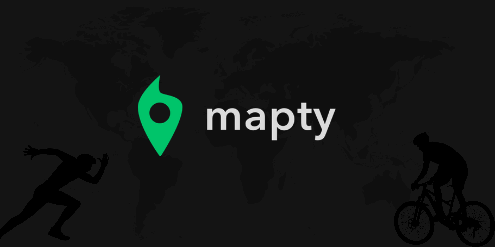

  <b>A great app to map your workouts</b>

# Mapty Workouts

## Table of Contents

- [Mapty Workouts](#mapty-workouts)
  - [Table of Contents](#table-of-contents)
  - [Overview](#overview)
    - [About the project](#about-the-project)
  - [New features checklist](#new-features-checklist)
  - [Screenshots](#screenshots)
    - [Desktop](#desktop)
    - [Mobile](#mobile)
  - [Link](#link)
  - [My Process](#my-process)
    - [Built With](#built-with)
    - [What I Learned](#what-i-learned)
  - [Author](#author)

## Overview

### About the project

This workout mapping project was developed during **Jonas Schdmedtmann's Javascript course**, and is being enhanced with some new suggested features. In addition, I adapted the project to be responsive and usable on all screen sizes.

## New features checklist

- [x] Responsive
- [x] Cancel form
- [x] Re-build objects prototype from Local Storage
- [ ] Edit workout
- [x] Delete workout

## Screenshots

### Desktop

### Mobile

## Link

- You can test the base version made by the teacher at this link: <a href="https://mapty.netlify.app/" target="_blank">Click here!</a>
- And you can also test my adapted version: <a href="https://mapty-evemon.netlify.app/" target="_blank">Click here!</a>
- Link to the course: <a href="https://www.udemy.com/course/the-complete-javascript-course/" target="_blank">Click here!</a>

## My Process

### Built With

- Semantic HTML5 markup
- CSS custom properties
- Flexbox
- CSS Grid
- Vanilla Javascript
- OOP

### What I Learned

The main objective of project development in learning is to fix the content about Object-Oriented Programming (OOP).

So I learned how to create classes and generate inheritance in ES6 and also some principles like the encapsulation of attributes and functions.

## Author

Made with 💜 by Evelyn Monteiro 👋
 

